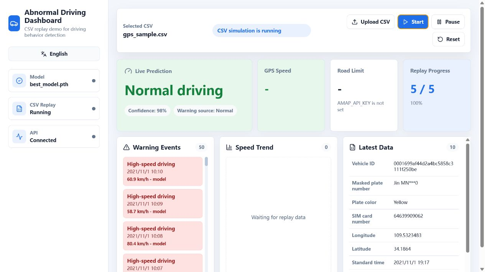

# Abnormal Driving Behavior Prototype

This project contains an undergraduate thesis prototype for abnormal driving behavior detection.

The main runnable client is:

```powershell
python abnormal_driving_client\client_app.py
```

The new React + Tauri client is in:

```powershell
abnormal_driving_client_tauri
```

## Browser Dashboard Demo

The browser dashboard is the recommended presentation view.



Start the Python API:

```powershell
cd C:\Users\Mth13\Desktop\project_code
.\.venv312\Scripts\python.exe -m uvicorn abnormal_driving_client.web_server:app --host 127.0.0.1 --port 8000
```

If the local virtual environment is not available, use another Python 3.12 environment with `requirements.txt` installed.
On this machine, the bundled Codex Python 3.12 runtime also works after installing `requirements.txt`:

```powershell
& 'C:\Users\Mth13\.cache\codex-runtimes\codex-primary-runtime\dependencies\python\python.exe' -m uvicorn abnormal_driving_client.web_server:app --host 127.0.0.1 --port 8000
```

Start the web dashboard in another PowerShell window:

```powershell
cd C:\Users\Mth13\Desktop\project_code\abnormal_driving_client_tauri
npm.cmd run dev
```

Then open:

```text
http://127.0.0.1:5173
```

The dashboard loads `gps_sample.csv` by default. You can also upload another CSV from the page.

Run it in development mode with:

```powershell
cd C:\Users\Mth13\Desktop\project_code\abnormal_driving_client_tauri
npm.cmd install
$env:PYTHON="C:\Users\Mth13\.cache\codex-runtimes\codex-primary-runtime\dependencies\python\python.exe"
npm.cmd run tauri dev
```

Tauri also needs Rust/Cargo installed on the machine.

## Setup

Create a fresh Python environment before running the client.

```powershell
py -3.12 -m venv .venv
.\.venv\Scripts\python.exe -m pip install -r requirements.txt
```

If Python 3.12 is not available, use a Python version that supports PyTorch.

## Optional Map API

The client can use Amap reverse geocoding to help check road speed limits.

Set the API key before running the client:

```powershell
$env:AMAP_API_KEY="your_api_key_here"
python abnormal_driving_client\client_app.py
```

If `AMAP_API_KEY` is not set, the client still runs. It only disables API-based speed-limit checking.

## Main Files

- `abnormal_driving_client/client_app.py`: main Tkinter client.
- `abnormal_driving_client/backend_runtime.py`: reusable Python runtime used by the React + Tauri client.
- `abnormal_driving_client/backend_service.py`: JSON bridge between Tauri and the Python runtime.
- `abnormal_driving_client_tauri/`: React + Tauri desktop client.
- `abnormal_driving_client/model_definition.py`: runtime model definition and feature list.
- `abnormal_driving_client/best_model.pth`: trained model weights.
- `abnormal_driving_client/scaler.gz`: saved feature scaler.
- `abnormal_driving_client/mqtt_publisher_dummy.py`: test MQTT publisher.

Older files such as `client_app2.py` and `3.py` are historical versions. Use `client_app.py` as the official client.
